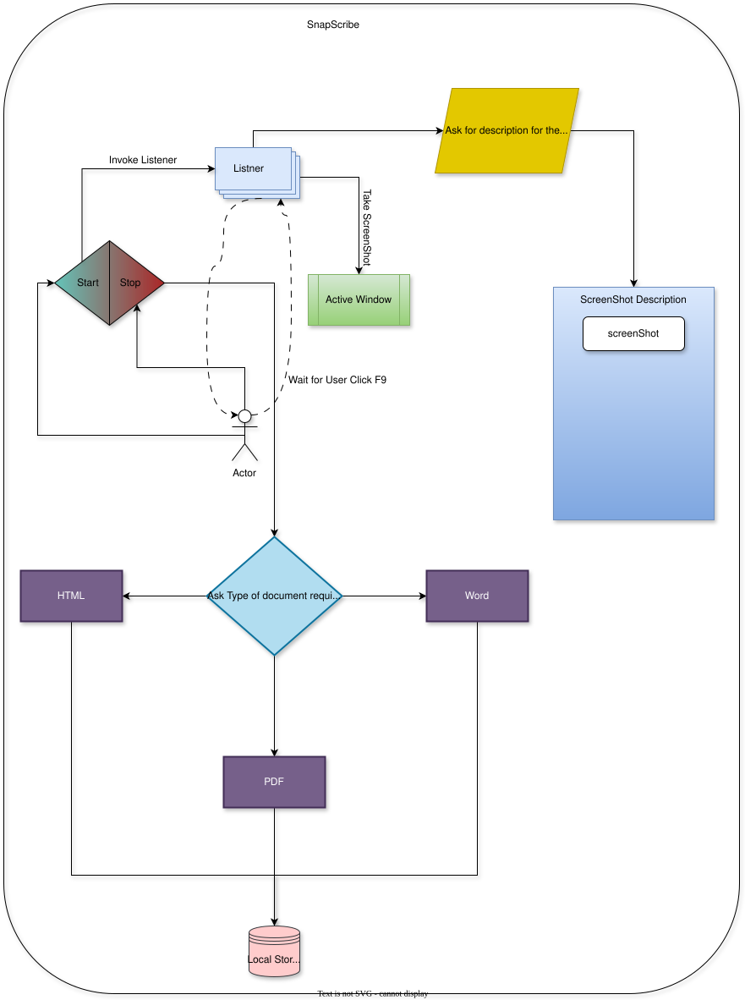
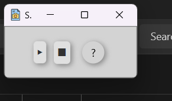
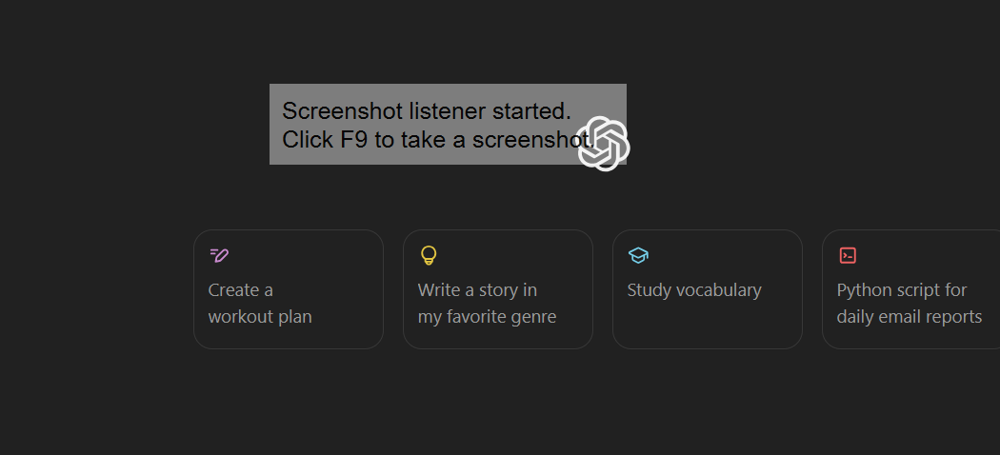
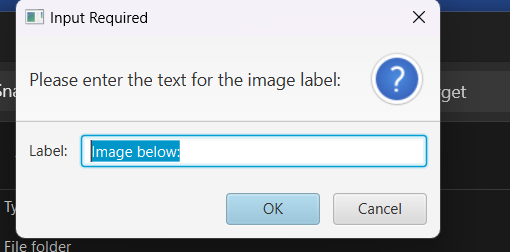
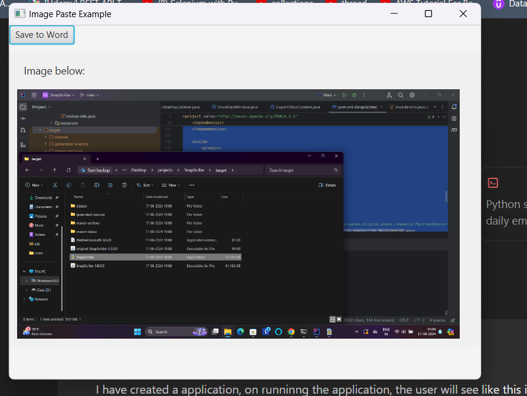

# SnapScribe


This is a JavaFX-based application designed to allow users to capture screenshots with a custom title and save them directly to a Word document. The application is packaged as an executable file for Windows, making it easy for users to download and start using without additional setup.

## Architecture


## Features

- **Screenshot Listener Activation**: Start the screenshot listener with a single click.
- **F9 Key Capture**: Press F9 to take a screenshot.
- **Custom Titles**: Provide a custom title for each screenshot.
- **Automatic Save**: Screenshots and titles are automatically saved in the background.
- **Save to Word**: Once done, save all captured screenshots to a Word document in your desired location.

## How to Use

1. **Download and Install**:
    - Download the executable file from the [releases](https://github.com/PrecisionTestAutomation/SnapScribe/releases) page.
    - Run the executable to start the application.

2. **Start the Listener**:
    - Launch the application. You'll see a small window with three buttons: Play, Stop, and Help.
    - Click the **Play** button to start the screenshot listener.
    - 

3. **Take a Screenshot**:
    - When you're ready to take a screenshot, press **F9**.
    - A pop-up window will appear, prompting you to enter a title for the screenshot.
    - 

4. **Provide a Title**:
    - Enter the desired title for your screenshot in the pop-up window and click **OK**.
    - The screenshot and its title will be saved in the background.
    - 

5. **Stop the Listener**:
    - Once you’ve taken all the screenshots, click the **Stop** button.
    - A window will display the screenshots with their titles and a button to **Save to Word**.
    - 

6. **Save to Word**:
    - Click the **Save to Word** button to save all screenshots and their titles into a Word document at your desired location.

## Installation

### Maven Build (For Developers)

1. Clone the repository:
   ```bash
   git clone https://github.com/PrecisionTestAutomation/SnapScribe.git
2. Navigate to the project directory:
   ```bash
   cd SnapScribe
3. Build the project using Maven:
   ```bash
   mvn clean install
4. Run the application:
   ```bash
   mvn javafx:run

## Windows Executable (For End Users)
- Download the `.exe` file from the [releases](https://github.com/PrecisionTestAutomation/SnapScribe/releases) page.
- Double-click the `.exe` file to start the application immediately.

## macOS Executable (For End Users)
- Download the `.dmg` file from the [releases](https://github.com/PrecisionTestAutomation/SnapScribe/releases) page.
- Double-click the `.dmg` file to open it.
- Drag the application into your `Applications` folder to install it.
- You can then launch the application from your `Applications` folder.


## License
This project is licensed under the MIT License - see the [LICENSE file](https://github.com/PrecisionTestAutomation/SnapScribe/blob/main/LICENSE) for details.

## Mac APP Generation
```bash
jpackage --type dmg --input ./target --name SnapScribe --main-jar SnapScribe-1.0.1.jar --main-class in.precisiontestautomation.snapscribe.Main --app-version "1.0.1" --icon ./src/main/resources/icons/file_885090.icns --mac-package-name "SnapScribe"
```

## Windows APP Generation
Load [convertJavaFxExe.xml](src%2Fmain%2Fresources%2FconvertJavaFxExe.xml) in [Launch4j](https://launch4j.sourceforge.net/) make the changes and save the file.